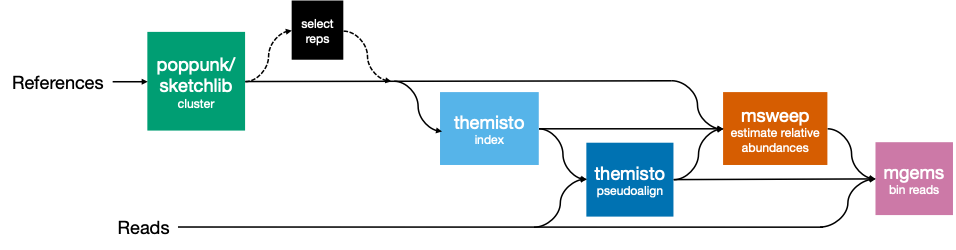
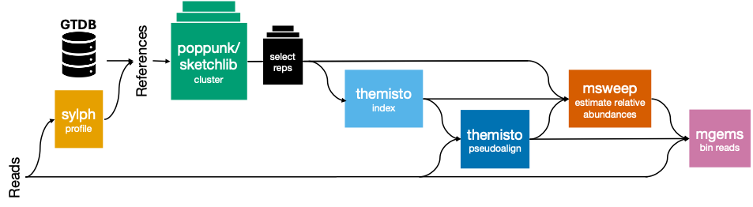

# gemsweep

[](https://www.nextflow.io/)
[](https://www.docker.com/)
[](https://sylabs.io/docs/)

[[_TOC_]]

## Pipeline overview

This workflow deconvolutes mixed read sets (e.g. plate sweep sequencing data, shotgun metagenomic data) and resolves these into strain-level resolution bins. At its core it implements Themisto pseudoalignment of reads to a curated set of references, mSWEEP to estimate relative abundances and mGEMS to bin reads.

Indexing references with Themisto and clustering are optionally automated, however if you have an index and a biologically meaningful grouping you may provide these and skip some computation.

Additionally, for large reference datasets with significant redundancy we offer a reference refinement option. This involves subsetting references to a configurable number of maximally distant representatives from the clusters — to conserve some within-cluster diversity whilst reducing compute demands.



Finally, we offer an **experimental** feature in which reference genomes can instead be automatically selected by setting `--ref_mode autoselect`. Only reads need to be provided; these will be queried using Sylph against GTDB to select appropriate genomes. This is still under development but feel free to try it out.



View the poster summary of this project presented at ISCB-UK 2026 [here](assets/ISCB_2026_gemsweep_poster.pdf).

## Usage

### Quickstart

#### From source code

1. Clone this repository (including submodules):

   ```bash
   git clone --recurse-submodules <repo-url>
   cd gemsweep
   ```

2. To run with `docker`, use the `-profile docker` option:

   ```bash
   nextflow run main.nf \
       -profile docker \
       --manifest manifest.csv \
       --ref_mode full \
       --references references.txt \
       --outdir my_output
   ```

   Other profiles are also supported (`singularity`).  
   :warning: If no profile is specified the pipeline will run with a Sanger HPC-specific configuration. This pipeline's default settings are optimised for the Sanger HPC, including use of temp storage. To run on other systems please configure the parameters appropriately.

3. Once the run has finished successfully and you have inspected the output, clean up intermediate files. The `work/` directory and `.nextflow.log` are useful for troubleshooting — do not delete them until you are satisfied the outputs are correct:

   ```bash
   rm -rf work .nextflow*
   ```

   Alternatively, use `nextflow clean` for more fine-grained control over which runs and intermediate files are removed.

#### Using on the Sanger farm

First load the pipeline module:

```bash
module load gemsweep
```

Then run on the command line with `gemsweep <options>`. For instance, to see a help message:

```bash
gemsweep --help
```

Submit to LSF:

```bash
bsub -o output.o -e error.e -q oversubscribed -R "select[mem>4000] rusage[mem=4000]" -M4000 \
    gemsweep \
        --manifest manifest.csv \
        --ref_mode full \
        --references references.txt \
        --outdir my_output
```

### Input

#### Manifest (`--manifest`)

A CSV file with the required header `ID,R1,R2`, containing per-sample paths to paired `.fastq.gz` files:

```
ID,R1,R2
sampleA,/path/to/sampleA_1.fastq.gz,/path/to/sampleA_2.fastq.gz
sampleB,/path/to/sampleB_1.fastq.gz,/path/to/sampleB_2.fastq.gz
```

#### Generating a manifest

**Sanger users:** the [manifest_generator](https://gitlab.internal.sanger.ac.uk/sanger-pathogens/pipelines/manifest_generator/) tool can generate a compatible `ID,R1,R2` manifest from a directory of FASTQ files or from iRODS.

#### Other input modes

This pipeline supports additional input modes via the `mixed_input` sub-workflow — these can be combined in a single run:

- **iRODS** (Sanger internal) — specify `--studyid`, `--runid`, `--laneid`, and/or `--plexid` on the command line; at least `--studyid` or `--runid` is required. A batch CSV of multiple iRODS searches can be supplied via `--manifest_of_lanes`. Requires an active iRODS session (`iinit`).
- **ENA download** — supply a file of ENA accession IDs via `--manifest_ena`. Set `--accession_type` to `run` (default), `sample`, or `study`.
- **Directory scan** — provide a path to a directory of FASTQ files via `--manifest_from_dir`. Use `--fastq_validation` (`strict`/`relaxed`, default: `strict`) and `--max_depth` (default: `0`) to control discovery.

For more detail, see the [mixed_input README](https://gitlab.internal.sanger.ac.uk/sanger-pathogens/pipelines/assorted-sub-workflows/-/blob/main/mixed_input/README.md).

#### References (`--references`)

A plain text file listing paths to reference FASTA files (one per line). Required when `--ref_mode` is `full` or `refine`:

```
/path/to/reference1.fasta
/path/to/reference2.fasta
```

Compatible parameters for each reference mode (`--ref_mode`):

| Reference mode | Required params                    | Description                                                                                                                                                                                                                                     |
| -------------- | ---------------------------------- | ----------------------------------------------------------------------------------------------------------------------------------------------------------------------------------------------------------------------------------------------- |
| `index`        | `--themisto_index`, `--ref_groups` | The supplied index and reference groupings are validated and used directly. The k-mer size must match `--themisto_k` (default: 31) and the group file must be in the same positional order as the references used when the index was built.     |
| `full`         | `--references`                     | All references are clustered (with the tool indicated by `--cluster_dist`) and indexed. No de-replication is applied.                                                                                                                           |
| `refine`       | `--references`                     | References are clustered and each cluster is de-replicated to at most `--representatives` maximally-distant genomes before indexing. Only compatible with `--cluster_dist core_acc`.                                                            |
| `autoselect`   | N/A                                | **Experimental.** References are not supplied; they are derived by querying reads against GTDB using Sylph. Reference refinement is always applied. In autoselect mode, clustering is always done with PopPUNK; `--cluster_dist` has no effect. |

> **⚠ Experimental feature — autoselection** `BETA`
>
> The autoselection feature is still **under development** in this release. Resource requirements can be high: the `POPPUNK` process can peak below 64 GB for most GTDB species, but `MSWEEP` may require significantly more for diverse samples. PopPUNK can also fail for species with very few available references.

### Output

Results are written to `--outdir` (default: `./results`):

```
results/
  ref_groups/                                        # ref_mode refine/autoselect only
    references.txt                                   # Representative references used for indexing
    groups.txt                                       # Reference-to-group assignments
  themisto/
    index.*                                          # Themisto index files (all modes except index)
    index_report.txt                                 # Themisto index statistics (all modes except index)
  clustering/
    <reference_ID>/
      <reference_ID>/*                               # Full PopPUNK output (if --publish_poppunk)
      groups.txt                                     # Reference group assignments (ref_mode full only)
  <sample_ID>/
    <sample_ID>_mSWEEP_abundances.txt               # mSWEEP relative abundance estimates
    <sample_ID>_mSWEEP_probs.tsv                    # mSWEEP read assignment probabilities
    mGEMS/
      <sample_ID>_<group>.fastq.gz                  # Binned reads per reference group
  sylph/                                             # ref_mode autoselect only
    combined_sylph_report.tsv                        # Combined Sylph query results across samples
    combined_sylph_filtered_report.tsv               # ANI/coverage-filtered Sylph profile
    taxon_refs/
      <taxon>.txt                                    # Reference lists per detected taxon
    taxon_group_ref_reports/
      <taxon_group>.tsv                              # Combined reference reports per taxon group
  <sample_ID>/sylph/                                 # ref_mode autoselect only
    <sample_ID>.paired.sylsp                         # Sylph sketch (if --save_sylph_sketches)
    <sample_ID>_sylph_profile.tsv                    # Per-sample Sylph query profile
```

#### Generate a manifest of binned reads

To generate a manifest of binned reads for downstream analysis, use `generate_manifest.py` from the assorted-sub-workflows submodule after your run has completed (path relative to repo root):

```bash
mkdir mGEMs_bins_manifest
./assorted-sub-workflows/mixed_input/bin/generate_manifest.py \
  --input ./results \
  --output mGEMs_bins_manifest \
  --fastq_validation relaxed \
  --max_depth 2
```

- `--input`: path to your results directory (set by `--outdir`, default: `./results`)
- `--output`: output CSV manifest of all discovered FASTQs
- `--max_depth 2`: searches 2 subdirectory levels deep, capturing all mGEMS bins across samples

### Parameters

**General options**

| Option              | Type      | Default     | Description                                                                                   |
| ------------------- | --------- | ----------- | --------------------------------------------------------------------------------------------- |
| `--manifest`        | `path`    | `null`      | Input manifest CSV with header `ID,R1,R2` (mandatory unless using other `mixed_input` modes). |
| `--outdir`          | `path`    | `./results` | Directory where results are written.                                                          |
| `--monochrome_logs` | `boolean` | `false`     | Output logs in plain ASCII (disable coloured logging).                                        |

---

**Workflow options**

| Option            | Type      | Default | Description                                                                              |
| ----------------- | --------- | ------- | ---------------------------------------------------------------------------------------- |
| `--ref_mode`      | `string`  | `null`  | Reference processing mode (mandatory). Options: `index`, `full`, `refine`, `autoselect`. |
| `--ref_prep_only` | `boolean` | `false` | Run only reference preparation steps, skipping pseudoalignment and binning.              |

---

**References options**

| Option              | Type      | Default    | Description                                                                                                          |
| ------------------- | --------- | ---------- | -------------------------------------------------------------------------------------------------------------------- |
| `--references`      | `path`    | `null`     | Text file with paths to reference FASTAs (one per line). Required for `full` and `refine` modes.                     |
| `--representatives` | `integer` | `20`       | Maximum representatives per cluster (used when `--ref_mode` is `refine` or `autoselect`).                            |
| `--cluster_dist`    | `string`  | `core_acc` | Clustering workflow. `core_acc` uses PopPUNK; `ani` uses Sketchlib. Applies when `--ref_mode` is `full` or `refine`. |

---

**PopPUNK options**

| Option              | Type      | Default  | Description                                                                           |
| ------------------- | --------- | -------- | ------------------------------------------------------------------------------------- |
| `--poppunk_model`   | `string`  | `dbscan` | Clustering model. Options: `dbscan`, `bgmm`.                                          |
| `--publish_poppunk` | `boolean` | `false`  | Publish full PopPUNK output to `clustering/`. Group assignments are always published. |

:warning: It is strongly recommended to leave `--publish_poppunk false` when using `--ref_mode autoselect` or `--ref_mode refine`. Outputs are generated on the full (non-dereplicated) genome set and can be very large.

---

**Sketchlib options** (when `--cluster_dist ani`)

| Option                | Type      | Default                | Description                                                                                                                                                 |
| --------------------- | --------- | ---------------------- | ----------------------------------------------------------------------------------------------------------------------------------------------------------- |
| `--sketchlib_kstep`   | `string`  | `13,29,4`              | K-mer sizes for sketching in the format `start,stop,step`.                                                                                                  |
| `--ani_threshold`     | `float`   | `0.02`                 | Maximum ANI distance for clustering (0.02 clusters genomes sharing >98% ANI similarity).                                                                    |
| `--cluster_algorithm` | `string`  | `connected_components` | Community-finding algorithm. Options: `connected_components`, `leiden`, `louvain`, `walktrap`, `fastgreedy`, `label_propagation`, `infomap`, `eigenvector`. |
| `--cluster_strict`    | `boolean` | `false`                | Fail early if all genomes form a single cluster or are all singletons.                                                                                      |

---

**Themisto options**

| Option             | Type      | Default | Description                                                                                                                                   |
| ------------------ | --------- | ------- | --------------------------------------------------------------------------------------------------------------------------------------------- |
| `--themisto_index` | `path`    | `null`  | Pre-built Themisto index prefix (without extensions). Used with `--ref_mode index`. Requires `--ref_groups`.                                  |
| `--themisto_k`     | `integer` | `31`    | K-mer size for index building and pseudoalignment. Options: `21`, `31`, `51`. Must match a pre-built index if `--themisto_index` is provided. |
| `--temp_dir`       | `path`    | `null`  | Custom temporary storage directory for index creation and pseudoalignment. Defaults to `/tmp`.                                                |
| `--temp_space`     | `integer` | `10000` | Temporary storage (MB) to reserve (only applies when `/tmp` is used as the temporary storage directory).                                      |

---

**mSWEEP options**

| Option         | Type   | Default | Description                                                                              |
| -------------- | ------ | ------- | ---------------------------------------------------------------------------------------- |
| `--ref_groups` | `path` | `null`  | Grouped references text file (one line per reference). Required with `--ref_mode index`. |

---

**mGEMS options**

| Option              | Type      | Default  | Description                                                                    |
| ------------------- | --------- | -------- | ------------------------------------------------------------------------------ |
| `--get_assignments` | `boolean` | `false`  | Output the read assignment table used by mGEMS for binning.                    |
| `--min_abundance`   | `float`   | `0.0001` | Minimum relative abundance. Only groups exceeding this will have reads binned. |

---

**Reference autoselection options** (`--ref_mode autoselect`)

| Option                  | Type      | Default                                                  | Description                                                                                                                          |
| ----------------------- | --------- | -------------------------------------------------------- | ------------------------------------------------------------------------------------------------------------------------------------ |
| `--sylph_db`            | `path`    | `/data/pam/software/sylph/gtdb_full_r226.syldb`          | Pre-built Sylph database (`.syldb`).                                                                                                 |
| `--sylph_tax_metadata`  | `path`    | `/data/pam/software/sylph-tax/v1/gtdb_r226_metadata.tsv` | Sylph-tax metadata TSV.                                                                                                              |
| `--sylph_k`             | `integer` | `31`                                                     | K-mer size for Sylph sketching. Options: `21`, `31`.                                                                                 |
| `--sylph_min_ani`       | `float`   | `95`                                                     | Minimum ANI threshold for Sylph candidate selection.                                                                                 |
| `--sylph_min_cov`       | `float`   | `0.01`                                                   | Minimum coverage threshold for Sylph candidate selection.                                                                            |
| `--taxonomic_rank`      | `string`  | `species`                                                | Taxonomic rank by which to group references. Options: `domain`, `kingdom`, `phylum`, `class`, `order`, `family`, `genus`, `species`. |
| `--save_sylph_sketches` | `boolean` | `true`                                                   | Keep Sylph sketch files (`.sylsp`) in the output directory.                                                                          |
| `--pool_latin_taxa`     | `boolean` | `false`                                                  | Pool GTDB taxa with alphabet suffixes (e.g. `Escherichia_coli_E` → `Escherichia_coli`). See docs for caveats.                        |
| `--genome_id_to_file`   | `path`    | See schema                                               | TSV mapping GTDB genome IDs to local FASTA paths.                                                                                    |

---

**Cache options** (`--ref_mode autoselect`)

| Option        | Type   | Default | Description                                                                                                                          |
| ------------- | ------ | ------- | ------------------------------------------------------------------------------------------------------------------------------------ |
| `--cache_dir` | `path` | `null`  | Path to a cache root for autoselect mode. The pipeline reuses previously computed per-species reference sets to avoid re-clustering. |

### Advanced usage

#### Using a pre-built index

Skip clustering and index building entirely by supplying a pre-built Themisto index and group assignments:

```bash
nextflow run main.nf \
    --manifest manifest.csv \
    --ref_mode index \
    --themisto_index /path/to/index_prefix \
    --ref_groups /path/to/groups.txt \
    --outdir my_output
```

#### Reference preparation only

Use `--ref_prep_only true` to build a Themisto index and group assignments file without running pseudoalignment or binning. The outputs can then be reused in a subsequent run with `--ref_mode index`:

```bash
nextflow run main.nf \
    --ref_mode refine \
    --references references.txt \
    --ref_prep_only true \
    --outdir my_output
```

#### Temporary storage

Themisto index creation requires substantial temporary disk space and the temp directory must be on the same filesystem as the compute node. On the Sanger HPC, scratch space is allocated automatically. On other systems, set `--temp_dir` to a path with sufficient capacity and adjust `--temp_space` accordingly.

### Dependencies

- Nextflow ≥ 22.03.0, < 26.04.0
- All software dependencies are containerised in publicly available Docker/Singularity images.
- For `autoselect` mode, Sylph/GTDB databases must be available (Sanger HPC defaults are pre-configured via `--sylph_db`, `--sylph_tax_metadata`, `--genome_id_to_file`).

## Software versions

| Software     | Version | Image                                                  |
| ------------ | ------- | ------------------------------------------------------ |
| Themisto     | 3.2.2   | `quay.io/sangerpathogens/themisto:3.2.2`               |
| mSWEEP       | 2.2.1   | `quay.io/biocontainers/msweep:2.2.1--h503566f_1`       |
| mGEMS        | 1.3.3   | `quay.io/biocontainers/mgems:1.3.3--h13024bc_2`        |
| PopPUNK      | 2.7.8   | `quay.io/biocontainers/poppunk:2.7.8--py310h4d0eb5b_0` |
| Sylph        | 0.8.1   | `quay.io/biocontainers/sylph:0.8.1--ha6fb395_0`        |
| pp-sketchlib | 2.1.5   | `quay.io/sangerpathogens/pp-sketchlib-python:2.1.5-c1` |

See `modules/` for pinned container versions.

## Troubleshooting

- **`--ref_mode` not set**: `--ref_mode` is required. Run `--help` for the full list of options.
- **Insufficient temporary disk space**: Themisto index creation requires substantial `/tmp` space. Set `--temp_dir` to a path with more capacity, or increase `--temp_space`.
- **mSWEEP finds no groups**: when using `--ref_mode index`, ensure `--ref_groups` matches the reference set used to build `--themisto_index`. Group labels must correspond one-to-one with references in the index, in the same positional order.
- **PopPUNK fails with too few references**: some species are underrepresented in GTDB; in `autoselect` mode these are skipped and will be absent from the final reference set.
- **Autoselect finds no candidates**: check that `--sylph_db` points to the correct Sylph database and that `--sylph_min_ani` / `--sylph_min_cov` thresholds are not too stringent.
- **Resuming a failed run**: add `-resume` to your command to restart from cached intermediate results.
- For further help, check `.nextflow.log` and the per-process `.command.log` logs in the `work/` directory.

Sanger users may find [this page](https://ssg-confluence.internal.sanger.ac.uk/spaces/PaMI/pages/181078206/General+pipeline+info#Generalpipelineinfo-Troubleshootingafailedpipelinerunandsendingabugreport) useful for troubleshooting Nextflow pipeline runs.

## Issues and Contributions

**GitHub users:** if you find an issue with this pipeline, or would like to suggest an improvement, please log an issue or open a pull request on this repository.

**Sanger users:** if you need internal support, you can raise an issue on the PAM Freshservice portal: https://sanger.freshservice.com/support/catalog/items/426
